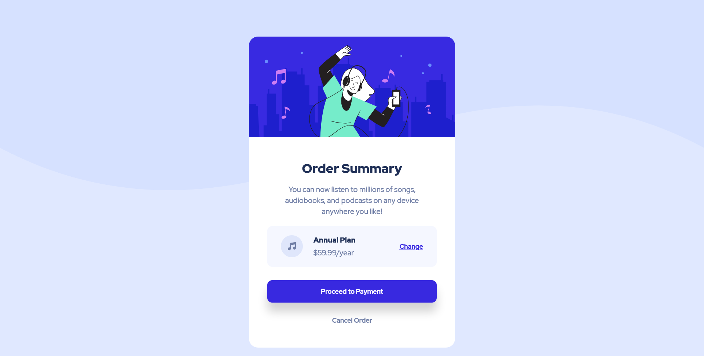

# Frontend Mentor - Order summary card solution

This is a solution to the [Order summary card challenge on Frontend Mentor](https://www.frontendmentor.io/challenges/order-summary-component-QlPmajDUj). Frontend Mentor challenges help you improve your coding skills by building realistic projects. 

## Table of contents

- [Overview](#overview)
  - [The challenge](#the-challenge)
  - [Screenshot](#screenshot)
  - [Links](#links)
- [My process](#my-process)
  - [Built with](#built-with)
  - [What I learned](#what-i-learned)
  - [Continued development](#continued-development)
  - [Useful resources](#useful-resources)
- [Author](#author)
- [Acknowledgments](#acknowledgments)

**Note: Delete this note and update the table of contents based on what sections you keep.**

## Overview

### The challenge

Users should be able to:

- See hover states for interactive elements

### Screenshot

### Links

- Solution URL: [Add solution URL here](https://github.com/MatheusFukuyama/OrderSummaryCard.git)
- Live Site URL: [Add live site URL here](https://matheusfukuyama.github.io/OrderSummaryCard/)

## My process

### Built with

- Semantic HTML5 markup
- CSS custom properties
- Flexbox

**Note: These are just examples. Delete this note and replace the list above with your own choices**

### What I learned

This project helps me to remind how to use the :hover effect and I also some flex properties. Talking about new knowledge I learned structure a project, read the project design to produce a code and finally to write a readme to the project.

### Continued development

I'm still want to improve my logic and also learn to write clean code, this project still can pass throght changes and refactoring while I get more knowledges.

**Note: Delete this note and the content within this section and replace with your own plans for continued development.**

### Useful resources

- [Example resource 1](https://www.w3schools.com) - This helped me to remind some of css features.

**Note: Delete this note and replace the list above with resources that helped you during the challenge. These could come in handy for anyone viewing your solution or for yourself when you look back on this project in the future.**

## Author

**- Website - [Add your name here](https://www.mathe.com)**
- Frontend Mentor - [@MatheusFukuyama](https://www.frontendmentor.io/profile/MatheusFukuyama)

**Note: Delete this note and add/remove/edit lines above based on what links you'd like to share.**

## Acknowledgments
